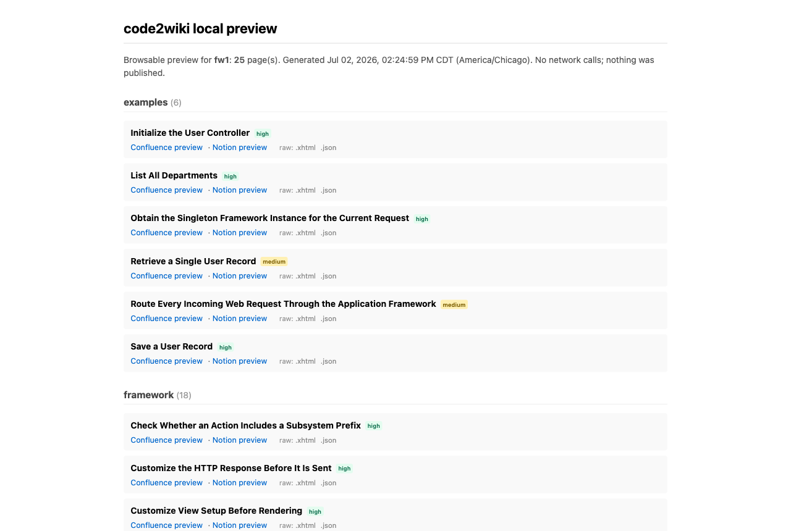
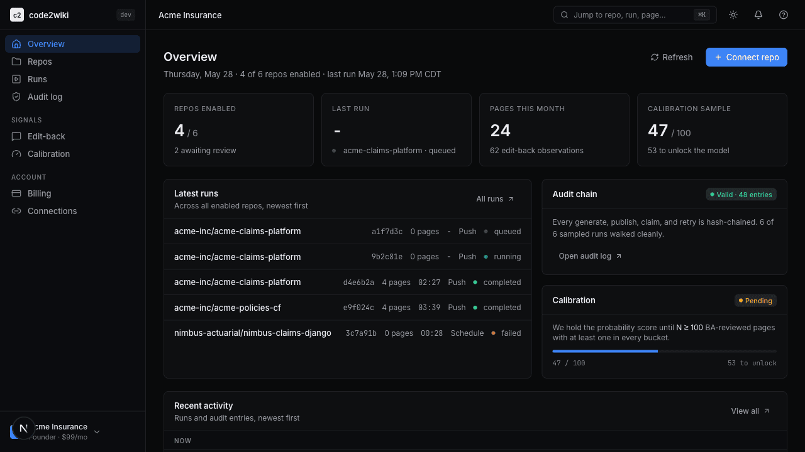
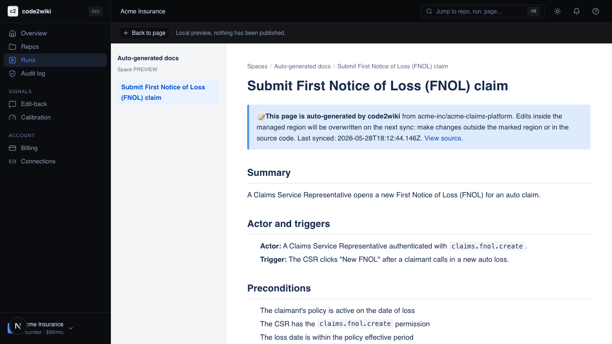
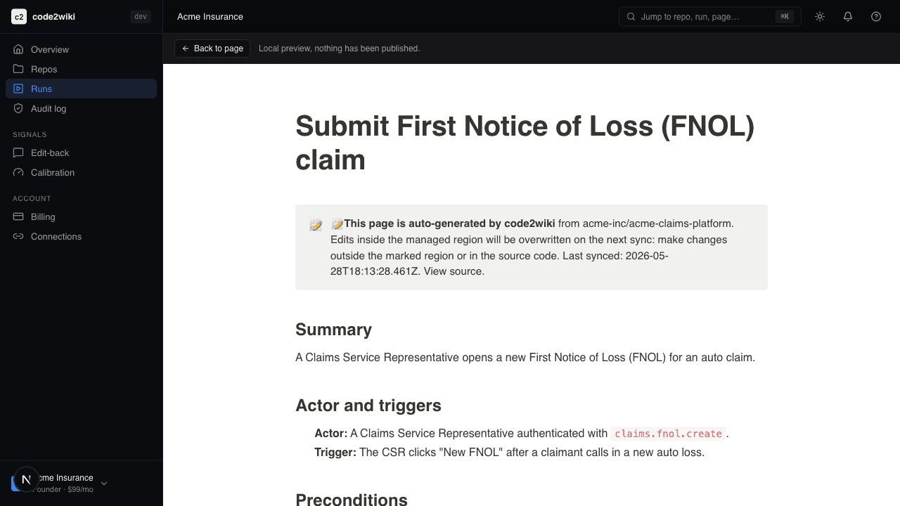
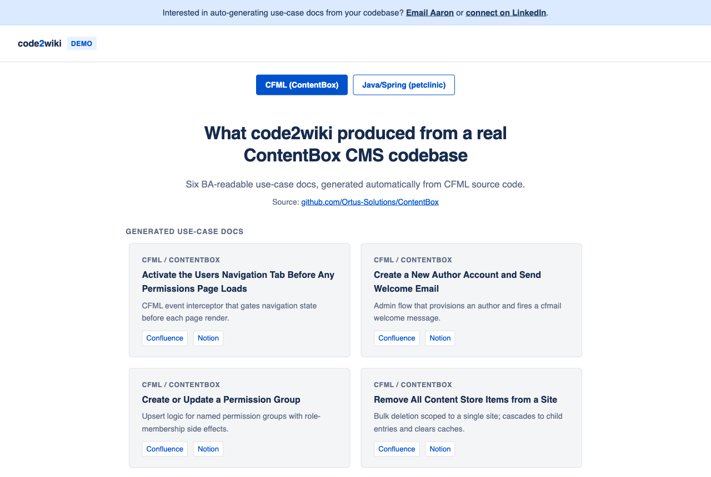
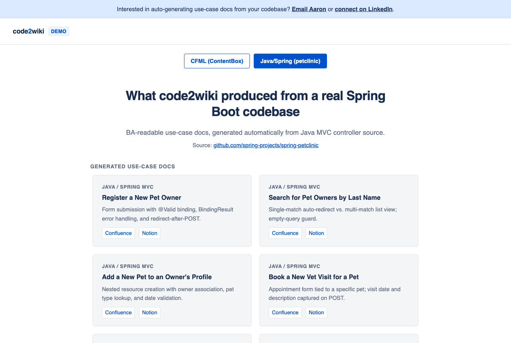
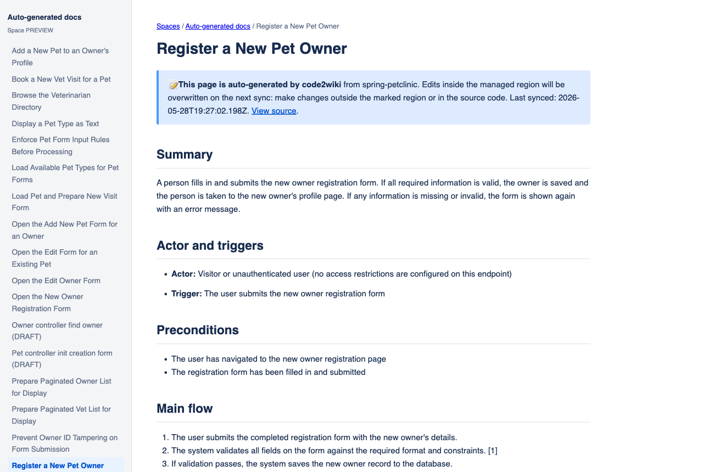

# Code2Wiki

> Confluence and Notion pages that always match the code your engineers just shipped, written for the BAs, QA, support, and auditors who never read your repo.

**Status:** Working CLI + hosted dashboard live in production. End-to-end pipeline operational against real legacy CFML and Java repositories; the hosted SaaS layer (GitHub App, auto-generate on push, in-app previews) is running with design-partner onboarding underway.

> **For hosted-dashboard customers, start here: [docs/getting-started.md](docs/getting-started.md).** The README below is the OSS CLI documentation; the hosted product has a different workflow (GitHub App, Sync-now button, in-app credential connections).

## What this is

Code2Wiki turns a source-code repository into **non-technical, use-case-style wiki pages**, the kind a business analyst, QA engineer, or auditor can actually read, and keeps them in sync with the code on every production release.

Unlike developer-facing doc tools (Mintlify, Swimm, DeepWiki) and unlike enterprise-only legacy modernization platforms (EPAM ART, Sanciti RGEN, Kodesage), Code2Wiki is built for a different buyer and a different job:

| | code2wiki | Mintlify | Swimm | DeepWiki | EPAM ART | Kodesage |
|---|:---:|:---:|:---:|:---:|:---:|:---:|
| **Primary audience** | BAs / QA / auditors | Developers | Developers | Developers | Enterprise IT | Enterprise IT |
| **Self-serve pricing** | Yes | Yes | No [^1] | No [^2] | No [^3] | No |
| **Pushes to Confluence / Notion** | Yes | No | No | No | No [^3] | No |
| **CFML / legacy-stack support** | Yes | No | No | No | No [^3] | No [^4] |
| **Commit-attributed audit log** | Yes | No | No | No | No [^3] | No |

[^1]: Swimm pricing page shows no self-serve tier; a demo or sales contact is required. Unverified as of 2026-05-28.
[^2]: DeepWiki has no public pricing page; self-serve availability unverified as of 2026-05-28.
[^3]: EPAM ART page returned HTTP 403 during verification; cells are based on EPAM's general enterprise-consulting model. Unverified as of 2026-05-28.
[^4]: Kodesage lists COBOL, RPG, Oracle Forms, and PowerBuilder as supported languages; CFML not mentioned as of 2026-05-28.

Where competitors genuinely outperform code2wiki today: **Mintlify** has a more polished developer-portal UX and is the right choice for teams publishing API reference docs to external users. **Swimm** embeds docs inline with source files and auto-updates them when functions are renamed, giving a tighter inner-loop developer workflow than code2wiki offers. **DeepWiki** answers natural-language questions about a repo instantly with no generation step, which is faster for ad-hoc code exploration. **EPAM ART and Kodesage** bundle human consultants alongside tooling; if your team needs a fully managed legacy-modernization engagement rather than a self-service tool, those are more appropriate choices. (Sanciti RGEN could not be evaluated: the site was unreachable as of 2026-05-28.)

- **Self-serve**: credit card, no sales call.
- **Workflow-native**: pushes to your existing Confluence / Notion / GitHub Wiki on every merge.
- **Audit-aware**: every doc change is attributed to a commit and replayable for SOX / HIPAA / FDA reviews.
- **Legacy-friendly**: first-class support for ColdFusion (CFML), Java EE, .NET monoliths, where generalist tools fall over.

## Screenshots

Local CLI preview (`code2wiki preview`): pages grouped by source folder with per-group counts, confidence badges, and timestamps rendered in the viewer's timezone:



Dashboard index showing recent runs, repo sync status, and the Getting Started guide:



Confluence lookalike preview of a generated use-case page (local render, nothing published):



Notion lookalike preview of the same page:



### Demo showcase

Live example output from two real codebases. CFML ContentBox and Java Spring PetClinic demos, with a 2-button switcher:



Java / Spring petclinic demo (same UI, different codebase):



What one of those cards opens: a BA-readable Confluence-format use-case page generated automatically from controller source:



## Quickstart

```bash
# 1. Install dependencies and build
git clone https://github.com/aqlong/code2wiki.git
cd code2wiki
npm install
npm run build

# 2. List candidate use cases in any Java / CFML project
node dist/cli/index.js list --cwd /path/to/your/project

# 3. Generate use case Markdown (mock mode: no API key needed)
node dist/cli/index.js generate --cwd /path/to/your/project --mock

# 4. Generate with the real LLM
export ANTHROPIC_API_KEY=sk-ant-...
node dist/cli/index.js generate --cwd /path/to/your/project
```

The output lands in `./docs/use-cases/` by default, one Markdown file per use case, ready to paste into Confluence, Notion, or commit to your repo.

## Languages supported (today)

| Language | File types | Parser | Status |
|---|---|---|---|
| Java (Spring MVC, JAX-RS, plain) | `.java` | tree-sitter | ✅ Shipped |
| CFML, script-style components | `.cfc` | Custom scanner | ✅ Shipped |
| CFML, tag-style components | `.cfc` | Custom scanner | ✅ Shipped |
| CFML, pages | `.cfm` | Custom scanner | ✅ Shipped |
| Ruby (Rails controllers) | `.rb` | Custom scanner | ✅ Shipped |
| Python (Django class-based + function views) | `.py` | Custom scanner | ✅ Shipped |

## LLM backends

Code2Wiki supports three LLM backends. **Mock mode is the default**: no key needed, runs the full pipeline with placeholder text.

### DeepSeek (default when DEEPSEEK_API_KEY is set)

```bash
export DEEPSEEK_API_KEY=sk-ds-...
code2wiki generate --cwd /path/to/your/project
```

| Env var | Required | Description |
|---|---|---|
| `DEEPSEEK_API_KEY` | ✅ | Your DeepSeek API key |
| `DEEPSEEK_BASE_URL` | optional | API base URL (default `https://api.deepseek.com`) |
| `DEEPSEEK_MODEL` | optional | Model name (default `deepseek-v4-flash`; `config.model` is NOT consulted on this backend) |

### Anthropic

```bash
export ANTHROPIC_API_KEY=sk-ant-...
code2wiki generate --cwd /path/to/your/project
```

### Azure OpenAI

If your team routes external AI traffic through Azure OpenAI, set these env vars and the Anthropic SDK is never contacted:

| Env var | Required | Description |
|---|---|---|
| `AZURE_OPENAI_API_KEY` | ✅ | Your Azure OpenAI resource key |
| `AZURE_OPENAI_ENDPOINT` | ✅ | e.g. `https://my-resource.openai.azure.com` |
| `AZURE_OPENAI_DEPLOYMENT` | optional | Deployment name (defaults to `config.model`) |
| `AZURE_OPENAI_API_VERSION` | optional | Defaults to `2024-10-21` |
| `AZURE_OPENAI_MAX_COMPLETION_TOKENS` | optional | Defaults to `16384`. Set lower (e.g. `4096`) for non-reasoning deployments like `gpt-4o` to tighten cost; leave at default for o-series reasoning models (`o1`, `o3`, `gpt-5`, `gpt-5-mini`) which consume invisible chain-of-thought tokens against this budget |
| `CODE2WIKI_LLM_BACKEND` | optional | Force `deepseek`, `azure-openai`, or `anthropic`; omit for auto-detect |

**Auto-detect rules** (in priority order):

1. `config.mock=true` or `CODE2WIKI_MOCK=1` → always mock, no API call.
2. `CODE2WIKI_LLM_BACKEND` env var → explicit override.
3. `config.llmBackend` in `code2wiki.config.json` → explicit config.
4. `DEEPSEEK_API_KEY` present → DeepSeek.
5. `ANTHROPIC_API_KEY` present → Anthropic.
6. Both Azure key + endpoint present → Azure.
7. Neither → mock (zero-cost smoke-test path).

```bash
export AZURE_OPENAI_API_KEY=...
export AZURE_OPENAI_ENDPOINT=https://my-resource.openai.azure.com
export AZURE_OPENAI_DEPLOYMENT=gpt-4o
code2wiki generate --cwd /path/to/your/project
```

> **Notes:**
> - `--estimate-cost` requires `ANTHROPIC_API_KEY` and is not available when the DeepSeek or Azure OpenAI backends are active (neither exposes a non-billed token-counting endpoint equivalent to Anthropic's `messages.countTokens`).
> - For o-series reasoning models, very large source files can exhaust `max_completion_tokens` on internal reasoning alone, producing an empty response. The error message will say `finish_reason=length`; raise `AZURE_OPENAI_MAX_COMPLETION_TOKENS` or split the file.
> - Retries (2x with exponential backoff) on transient 429/500 errors are handled automatically by the underlying `openai` SDK.

## Publishing to Confluence or Notion

After `code2wiki generate` writes Markdown to your output directory,
`code2wiki publish <target>` pushes those pages into a real wiki:

```bash
# Set up credentials in .env (see .env.example)
# Then dry-run to see what would be published:
node dist/cli/index.js publish confluence --cwd /path/to/repo --dry-run

# When you're happy, push for real:
node dist/cli/index.js publish confluence --cwd /path/to/repo
node dist/cli/index.js publish notion     --cwd /path/to/repo
```

**Idempotent slug-based upsert.** Each page is identified by its
`code2wiki_id` (stable across regenerations). On every push:

- New pages are created
- Existing pages are updated in place (Confluence increments the
  version number; Notion replaces the body and updates the title)
- Human edits made *outside* the `<!-- code2wiki:managed -->` fence
  are preserved in Confluence (the entire managed region is replaced;
  anything before/after stays)

**Notion setup quirk:** the destination database must have a Rich
Text property named exactly `code2wiki_id` so the publisher can look
up existing pages. Add it once before your first publish.

**Coexistence with existing wikis (ADR-016, shipped 2026-05-07).** Three publish modes let you point code2wiki at a real legacy wiki space without overwriting hand-written content:

- `greenfield` (default), touches only pages we previously created.
- `claim`: preflight blocks the publish on title collisions; you adopt each conflicting page with `code2wiki claim <page-id-or-url> --target=<x> --map-to=<id>`. The original content is preserved outside the managed fence.
- `parallel`: never touches unlabeled pages; nests our docs under a `code2wiki/` parent (Confluence) or `Section: code2wiki` rich-text property (Notion).

Configure per-target in `code2wiki.config.json` under `publish.<target>.{mode, slugPrefix, titlePrefix, parentPageId, banner}`, or override at runtime with `--mode=<x>`. Every published page gets a 📝 attribution banner. Preflight results land in `.code2wiki/preflight.json` so CI can inspect them. The full design is written up in `docs/wiki-coexistence.md` in the private monorepo.

## Audit log (compliance-friendly)

Every `generate` and `publish` writes a hash-chained entry to
`.code2wiki/audit.jsonl`:

```bash
node dist/cli/index.js audit show         # last 20 entries
node dist/cli/index.js audit verify       # check chain integrity
```

Each entry records the timestamp, commit SHA, page slug, outcome
(created / updated / unchanged / skipped / error), content SHA-256,
and the previous entry's hash. Tampering with any entry breaks the
chain and is detected by `audit verify`.

For SOX, HIPAA, and FDA-validation buyers: commit the audit log to
your repo (remove `.code2wiki/` from `.gitignore`) and the chain
becomes a tamper-evident record of every doc change tied to a commit.

## Auto-running on every commit

Copy [`docs/templates/code2wiki.yml`](docs/templates/code2wiki.yml) to `.github/workflows/code2wiki.yml` in your project. On every push to `main`, it:

1. Installs and builds code2wiki from this repository
2. Runs `code2wiki generate` against your repo, diff-aware (`--since` the previous commit) so unchanged files are skipped (set the `ANTHROPIC_API_KEY` secret, or leave it unset and the run falls through to `--mock` with clearly-marked draft pages)
3. Commits any updated use-case docs back into `docs/use-cases/`

Before enabling it, point the workflow's `paths:` trigger at your application source directories and never list the generated `docs/use-cases/` output there, otherwise the commit-back step re-triggers the workflow in a loop (the template's comments explain the incident that lesson comes from).

## Architecture

```
┌─────────────────────────────────────────────┐
│  OSS CLI (this repo, MIT)                   │
│  - Per-language parsers (tree-sitter +      │
│    custom scanners; see the table above)    │
│  - Multi-backend LLM client (Anthropic /    │
│    Azure OpenAI / DeepSeek) + prompt cache  │
│  - Deterministic mock for tests / no-key    │
│  - Stable IDs + idempotent slugs            │
└────────────────┬────────────────────────────┘
                 │ same engine
┌────────────────▼────────────────────────────┐
│  Hosted SaaS (proprietary, separate repo)   │
│  - GitHub App, push-to-main webhook         │
│  - Diff-aware regen on changed files only   │
│  - Confluence + Notion sync                 │
│  - Hash-chained audit log of every change   │
└─────────────────────────────────────────────┘
```

Full design rationale lives in `docs/architecture.md` in the private monorepo.

## Worked examples

Hand-curated gold-standard outputs that double as the regression test suite:

| Example | Language | Pattern | What makes it interesting |
|---|---|---|---|
| [`spring-petclinic-owner-create/`](examples/spring-petclinic-owner-create/) | Java / Spring MVC | GET+POST form | `@InitBinder` hidden business rule; redirect-after-POST |
| [`spring-petclinic-find-owners/`](examples/spring-petclinic-find-owners/) | Java / Spring MVC | Query + conditional redirect | 3-branch logic: empty / single-match auto-redirect / multi-match list |
| [`masacms-publish-site/`](examples/masacms-publish-site/) | CFML (tag-based) | Event + multi-step publish | Complex side effects across cfquery, cfinvoke, cfmail |
| [`django-blog-post-publish/`](examples/django-blog-post-publish/) | Python / Django | Class-based views | Edit + delete pair; `LoginRequiredMixin` ownership rule |

Each example contains the upstream source pointer, the ideal Markdown output, and notes on what makes it interesting.

## Repo layout

```
code2wiki/
├── README.md
├── LICENSE                      # MIT
├── package.json
├── tsconfig.json
├── vitest.config.ts
├── docs/                        # getting-started guide (+ strategy, ADRs in the private monorepo)
├── src/
│   ├── cli/                     # commander entry + commands
│   ├── core/                    # extraction engine
│   │   ├── parsers/             # per-language parsers (tree-sitter + scanners)
│   │   ├── llm/                 # multi-backend LLM client + prompts + mock
│   │   ├── publishers/          # Confluence + Notion + preflight + fence helpers
│   │   ├── feedback/            # draft validator (chain-of-correction)
│   │   ├── extractor.ts         # candidate → UseCase
│   │   ├── renderer.ts          # UseCase → Markdown
│   │   ├── audit.ts             # hash-chained audit log
│   │   ├── scan.ts              # walk project, run parsers
│   │   ├── config.ts            # config schema (zod)
│   │   ├── git.ts               # commit metadata helpers
│   │   ├── types.ts             # shared types
│   │   └── util/                # slug, env, lines
│   └── index.ts                 # library entry
├── examples/                    # gold-standard demos + regression fixtures
├── tools/scripts/               # local verification toolbox
└── references/                  # cloned demo codebases (gitignored)
```

## Roadmap

The working roadmap lives in `docs/roadmap.md` in the private monorepo. Status:

- ✅ **Week 1**, CFML + Java parser + first real-app demos + tests + CI
- ✅ **Week 2**, Hosted dashboard: Next.js 15 + Auth.js (GitHub OAuth) + Drizzle/Postgres + GitHub-App webhook handler + Octokit-driven worker (real `git clone --depth=1` against installation tokens) + run-trigger route + repo-list and audit-log dashboard surfaces. Live in production since 2026-05-08.
- ✅ **Week 3**, Confluence + Notion publishers (CLI version)
- ✅ **Stripe billing**, live in production since 2026-05-13 (self-serve Checkout + Billing Portal)
- ⏳ **Week 4**, 5 warm-network design partners (ADR-016 coexistence prerequisite ✅ shipped)
- ✅ **Week 6**, Diff-aware regen + hash-chained audit log (+ opt-in Ed25519 signing)
- ⏳ **Week 7**, Adobe ColdFusion forum + Ortus Solutions outreach
- ⏳ **Week 8**, Public launch

## Development

```bash
npm install        # install dependencies
npm run build      # compile to dist/
npm run typecheck  # tsc --noEmit
npm test           # vitest
npm run dev        # run CLI without building (tsx)
```

Tests run without an LLM key (deterministic mock mode). Real LLM integration requires a backend key (see LLM backends above); the Anthropic path uses prompt caching on the system prompt to keep costs low.

## CLI reference

Snapshot of `code2wiki --help` and each subcommand (captured from current source; refresh on every prompt-version bump).

```
Usage: code2wiki [options] [command]
Generate non-technical, use-case-style wiki pages from source code

Options:
  -V, --version               output the version number
  -h, --help                  display help for command

Commands:
  init        Create a default code2wiki.config.json
  list        List candidate use cases the parser would extract
  generate    Generate Markdown use cases under the configured output dir
  validate    Validate config and the contents of the output directory
  publish     Push generated docs to a wiki (target: confluence | notion)
  claim       Adopt an existing wiki page as the source for a generated use case
  preview     Render a browsable local preview (Confluence + Notion lookalikes)
  audit       Inspect the hash-chained audit log (show | verify | keygen)
  replay      Re-run audit entries through the current prompt; report diffs
```

**`generate` flags** (most-used subcommand):

```
  --cwd <dir>               Project root
  --mock                    Skip LLM calls; produce deterministic mock output
  --limit <n>               Cap number of candidates processed
  --only <substring>        Filter candidates by source-file path
  --name <name>             Exact function/method name match (suffix ok)
  --since <ref>             Only regenerate files changed since this git ref
  --estimate-cost           Count tokens + project USD cost; no LLM call
  --min-confidence <level>  Skip pages below this confidence (high|medium|low)
```

**`publish` flags:**

```
  --cwd <dir>          Project root
  --dry-run            Show what would be published without calling the API
  --mode <mode>        greenfield (default) | claim | parallel
  --ignore-collisions  In claim mode, proceed past unresolved collisions
```

**`audit` flags:**

```
  --cwd <dir>        Project root
  --limit <n>        Number of recent entries to show
  --require-signed   Fail if any entry is unsigned (verify only)
  --key-path <path>  Output path for generated private key PEM (keygen only)
```

**`replay` flags:**

```
  --cwd <dir>                Project root
  --since <commit>           Only replay entries from this commit forward
  --since-version <version>  Only replay entries produced at or before this prompt version
  --limit <n>                Cap distinct slugs to replay (after dedupe)
  --mock                     Use deterministic mock output (no API call)
```

## License

MIT (see [LICENSE](LICENSE)). The OSS CLI is and will remain MIT-licensed.
The hosted SaaS layer (Confluence/Notion publishing, dashboard, audit log) is proprietary.
